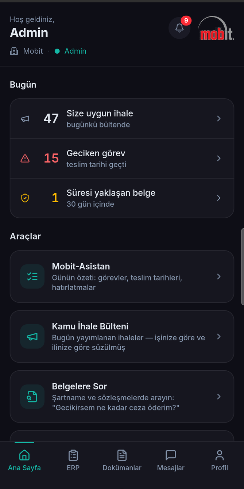
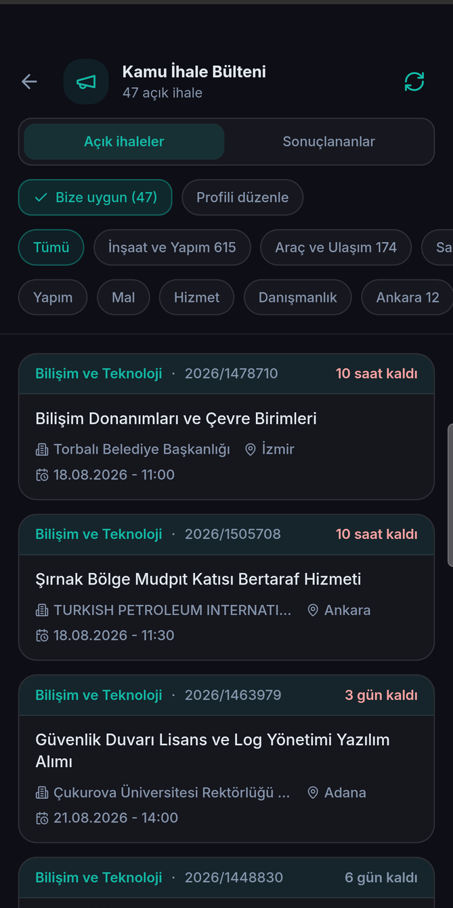
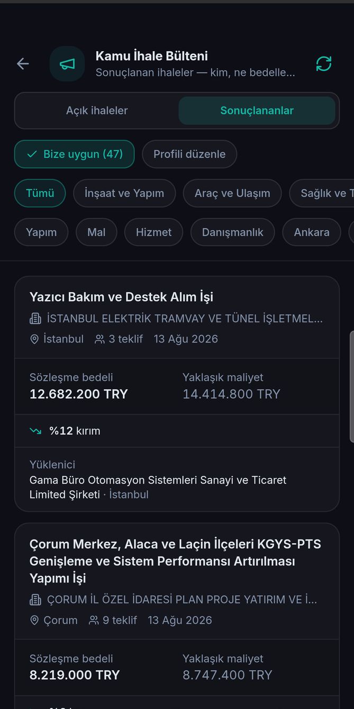
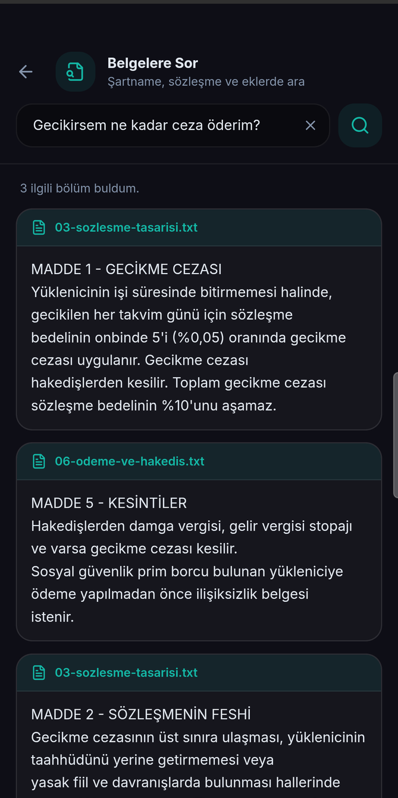
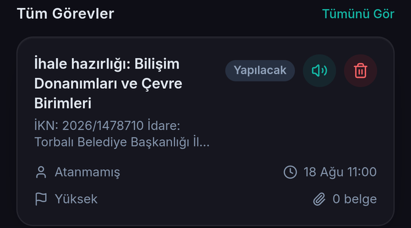
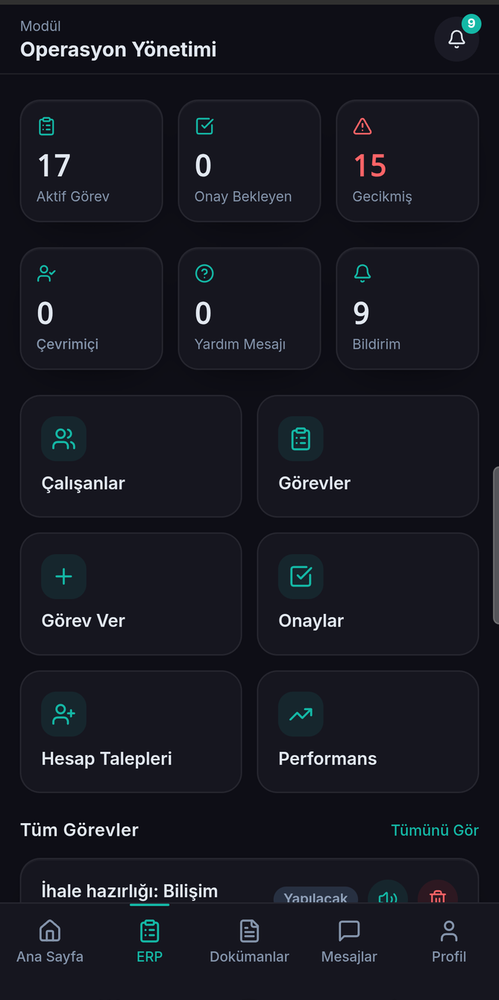

# Mobit Dürt

**Kamu ihalelerine giren şirketler için operasyon platformu.**

Her iş günü Kamu İhale Bülteni'nde dört yüze yakın ilan yayımlanır ve bir şirket bunların
belki ikisine girer. Geri kalanı gürültüdür. Bu platform o gürültüyü şirketin kendi iş
koluna ve iline göre süzer, girilmeye değer olanı bir hazırlık görevine dönüştürür,
sonucu yayımlandığında da işi kimin ne bedelle aldığını söyler.

Gerçek bir şirkette, gerçek veriyle çalışıyor: bülten her sabah 09:30'da kendiliğinden
çekiliyor, günde yaklaşık 300 ilan ve 1.400 sözleşme ayrıştırılıyor.

<table>
  <tr>
    <td width="33%"></td>
    <td width="33%"></td>
    <td width="33%"></td>
  </tr>
  <tr>
    <td align="center"><sub>Bugün ne var</sub></td>
    <td align="center"><sub>Açık ihaleler</sub></td>
    <td align="center"><sub>Sonuçlar ve kırım oranı</sub></td>
  </tr>
</table>

---

## Ne yapıyor

### Bülten, size uygun olana indirgenmiş

EKAP'ın dört günlük bülteni (mal, yapım, hizmet, danışmanlık) her sabah indiriliyor,
PDF'ten ayrıştırılıyor ve on bir iş koluna ayrılıyor. Şirket bir kez "biz elektrik işi
yaparız, Konya ve çevresinde" der; her sabah kendisine uyan ilanları görür ve bir bildirim
alır.

Kategori eşleştirmesi kelime başına sabitlenmiş: `"et alım"` ifadesi *"Hizmet Alımı"*
içinde eşleşip 45 canlı ihaleyi gıda diye dosyalamıştı. Kök çözüm, başka bir anahtar
kelime yaması değil, `(?<!\p{L})` ile kelime sınırına demirlemek oldu.

İptal ilanları saklanıyor ama asla girilecek iş gibi gösterilmiyor — iptal olmuş bir
ihaleyi teklif verilecek gibi göstermek, boş ekrandan kötüdür.

### Sonuçlar: iş kaça verildi

İlan, idarenin ne istediğini söyler. Sonuç ilanı işin **kaça verildiğini** söyler ve asıl
fiyat kararı bu ikisinin arasında verilir: idarenin kendi yaklaşık maliyeti ile sözleşme
bedeli. Aradaki fark — kırım oranı — bir günde yüzde birden yüzde altmışa kadar gidiyor ve
ilana bakarak hangisi olduğu anlaşılmıyor.

Kırım **yalnız dürüstçe hesaplanabildiği yerde** yazılıyor. Kısımlara bölünmüş ihalede
yaklaşık maliyet bütün ihaleyi, sözleşme bedeli tek kısmı kapsar: on bir kalemlik bir ilaç
ihalesinin ilk kısmı 1,6 milyonluk tahmine karşı 25 bin liraya verilmiştir — bu %98
tasarruf değil, aritmetik kurgudur. Böyle bir sayı insanlara, sayının gerçek olduğu
günlerde de güvenmemeyi öğretir. O yüzden orada rakam yerine sebebi yazıyor.

Karta dokununca ilan basıldığı hâliyle açılıyor; karttaki rakamlar o metinden ayrıştırıldı
ve teklifini buna göre fiyatlayacak insanın bir ayrıştırıcının sözüne güvenmesi gerekmiyor.

<br clear="right">

### Belgelere Sor



Şirketin kendi şartname, sözleşme ve eklerinde anlam tabanlı arama. Soru gündelik dille
yazılır; belgedeki kelimeleri bilmek gerekmez.

Cevap **belgenin kendi metnidir**, üretilmiş bir özet değil — geldiği dosya adıyla
birlikte. Bir şartname için bu bir eksiklik değil, ürünün kendisidir: alıntılanan madde
açılıp kontrol edilebilir, teklif kararı veya gecikme cezası gibi hukuki ağırlığı olan bir
cevabın kontrol edilebilir olması gerekir. Ayrıca dosyada olmayan bir kuralı uyduramaz —
insanların bu tür özelliklerden haklı olarak korktuğu şey tam olarak budur.

Gömme modeli (`multilingual-e5-base`) kendi sunucumuzda çalışıyor; belge metni hiçbir
zaman dışarı çıkmıyor.

<br clear="right">

### İlandan göreve, görevden sonuca



Bir ilanı okumak işin yarısı. İhale salı günü 11:30'da kapanıyorsa yeterlik belgelerini
toplamak, fiyatlamak ve teminat mektubunu almak günler alır — ve bunun birinin panosunda
başlaması gerekir, birinin aklında değil. Tek dokunuşla açılan hazırlık görevinin teslim
tarihi ihale saatinin kendisidir, böylece mevcut gecikme eskalasyonu ihaleye doğru geri
saymaya kendiliğinden başlar.

Haftalar sonra sonuç yayımlandığında, o görevi hazırlayanlara bildirim gider:
*"Takip ettiğiniz ihale sonuçlandı — X firması 54,5 milyona aldı, %33,8 kırım."*
Yalnız görev açılmış ihaleler duyurulur; ekrandan geçen üç yüz ilanın hepsini bildirmek
bülteni ikinci kez göndermek olurdu.

### Operasyon



Görev atama, alt görevler ve bağımlılıklar, teslim tarihi takibi, gecikme eskalasyon
merdiveni, tamamlama talebi ve yönetici onayı, standart ara/nihai rapor formatı,
performans özeti.

Yanında: şirket içi mesajlaşma ve doküman odaları, belge önizleme (PDF/DOCX/XLSX), bildirim
merkezi, sesli asistan (kendi sunucumuzda Piper TTS), ve **şirket belgeleri takibi** — imza
sirküleri, oda kayıt belgesi, borcu yoktur yazısı. Her idare bunları ister, hepsinin süresi
dolar, ve kimse teklif hazırlanana kadar fark etmez.

<br clear="right">

---

## Nasıl çalışıyor

```
                    ┌─────────────────────────────┐
   EKAP bülteni ───▶│  Python yardımcı servis     │  poppler ile PDF → metin
   (4 PDF/gün)      │  FastAPI + sentence-transf. │  ilan + sonuç ayrıştırma
                    │                             │  gömme vektörleri (e5-base)
                    └──────────────┬──────────────┘
                                   │  iç ağ, dışarı kapalı
                    ┌──────────────▼──────────────┐
   Android  ───────▶│  Spring Boot 4.1 / Java 21  │◀─── React web paneli
   (Capacitor)      │  JWT, roller, Flyway (59)   │
                    └──────────────┬──────────────┘
                                   │
                             PostgreSQL 17
```

Gömme vektörleri `pgvector` yerine `BYTEA` içinde paketlenmiş `float32` olarak duruyor:
üretimdeki `postgres:17-alpine` imajında pgvector yok ve canlı bir veritabanının imajını
bir özellik uğruna değiştirmek, o özelliğin kendisinden büyük bir iş. Korpus bu ölçekte
tam taramayla rahat dönüyor; darboğaza gelirse geçiş mekanik — kolon `vector(N)` olur,
tarama indeks aramasına döner.

Bülten her müşteri için aynı kamuya açık belge olduğu için yardımcı servis onu bir kez
indirip dört saat önbellekte tutuyor: on müşteri, aynı PDF'in kırk kez indirilmesi
demek olmasın diye — hem bizim için yavaş hem de karşı tarafa saygısızlık.

Ayrıştırmayı yardımcı serviste yapmanın sebebi poppler'ın orada olması. `pdftotext`
**`-layout` ile** çalıştırılmak zorunda: ilanlar iki sütunlu bir tablo ve bu bayrak
olmadan bütün etiketler bir blokta, bütün değerler başka blokta çıkıyor.

### Ölçerek çözülmüş üç tuzak

Bu üçü, kodun neden böyle yazıldığını en iyi anlatan yerler:

| Sorun | Kök neden | Çözüm |
|---|---|---|
| Pazarlık usulüyle yapılan 13 ihalenin yaklaşık maliyeti boş geliyordu | Bu ilanlar araya bir alan sokup maliyeti `d)`'den `e)`'ye itiyor | Alanlar harfle değil **etiketle** okunuyor |
| Bütün pazarlık sonuçlarında tutar yutuluyordu | Tablo satırı sayfaya taşınca `pdftotext` arkasına ok bırakıyor: `87.231.881,17 TRY -->` | Tutar deseni satır sonuna sabitlenmiyor |
| Bir İzmir demiryolu işi Van'a yazılıyordu | İl adları alt dize olarak eşleşiyor; bir sayfa Türkçe düzyazı yanlış il üretmeye yetiyor | İl **yalnız** işin yerinden ve idare adından okunuyor, kazananın adresinden asla — beşte biri boş kalıyor, ki bu dürüst cevap |

Ortak ders: **yanlış bir değer, eksik bir değerden kötüdür.** Yanlış ile yazılmış bir ihale,
ilsiz olandan; uydurulmuş bir kırım oranı, hiç oran olmamasından kötüdür.

---

## Teknoloji

| Katman | |
|---|---|
| Backend | Java 21, Spring Boot 4.1, Spring Security (JWT), Flyway |
| Veritabanı | PostgreSQL 17 (gömme vektörleri `BYTEA`, pgvector'suz) |
| Mobil | React + TypeScript, Capacitor 7 (Android), Tailwind, lucide-react |
| Web | React + TypeScript + Vite |
| Yardımcı servis | Python, FastAPI, sentence-transformers (`multilingual-e5-base`), poppler, Tesseract |
| Sesli asistan | Piper TTS (kendi sunucumuzda) |
| Bildirim | Firebase Cloud Messaging |
| Dağıtım | Docker Compose, Caddy (otomatik TLS), GitHub Actions |

Yaklaşık ölçek: 238 Java sınıfı, 68 test sınıfı, 59 Flyway migrasyonu, 58 mobil modül.
Testler: backend'de 321 test (163'ü birim testi, 158'i Testcontainers ile gerçek PostgreSQL
üstünde entegrasyon), mobilde 158 test.

### Çalıştırma

Geliştirme kurulumu, ortam değişkenleri ve tüm API uçları:
**[docs/DEVELOPMENT.md](docs/DEVELOPMENT.md)**

Üretim işletimi: [PRODUCTION_DEPLOYMENT.md](PRODUCTION_DEPLOYMENT.md) ·
[MONITORING_PLAN.md](MONITORING_PLAN.md) · [RESTORE.md](RESTORE.md)

Mimari ve karar kayıtları: [ARCHITECTURE.md](ARCHITECTURE.md) · [STACK.md](STACK.md)

---

## Durum

Üretimde, tek bir şirkette çalışıyor. Çok kiracılı (multi-tenant) hâle getirme,
onboarding akışı ve yeterlik kontrol listesi üzerinde çalışılıyor.

Depodaki `backend/` (arşivlenmiş Python FastAPI), `contracts/` ve `figma_frontend/`
dizinleri geçmişten kalma ve dondurulmuş durumda — canlı kod `java-backend/`,
`mobile_frontend/`, `frontend/` ve `embedding-service/` içinde.

Bu depo bir ürünün kaynak kodudur, kurulup çalıştırılmak üzere paketlenmiş bir açık
kaynak projesi değildir. İnceleyip fikir edinmek serbesttir; ticari kullanım için
iletişime geçin.

---

<details>
<summary><b>English summary</b></summary>

**An operations platform for Turkish companies that bid on public tenders.**

Around four hundred tenders are published in Turkey's official procurement bulletin every
working day, and a given company can bid on maybe two of them. This platform filters that
down to a company's own line of work and province, turns the ones worth bidding on into
preparation tasks with the tender hour as their deadline, and — weeks later, when the
result bulletin is published — tells the people who prepared the bid who won it and for
how much.

Key pieces:

- **Bulletin ingestion.** Four daily PDFs are downloaded, parsed with poppler, and sorted
  into eleven trades. Word-boundary-anchored Turkish matching, after a substring match
  filed 45 live tenders under the wrong category.
- **Award results.** The buyer's own cost estimate beside the price the work was actually
  let for. The discount is published *only* where it can be computed honestly — a tender
  awarded in lots would otherwise read as a 98% saving, which is arithmetic fiction.
- **Ask your documents.** Semantic search over the company's own specifications and
  contracts, answering with the source clause and its filename rather than a generated
  summary — for a legally binding document, that auditability is the product. The
  embedding model runs on our own server; document text never leaves the host.
- **Operations.** Task assignment, dependencies, deadline escalation, completion approval,
  internal document rooms, and expiry tracking for the company's own paperwork.

Java 21 / Spring Boot 4.1, PostgreSQL 17, React + Capacitor 7 (Android), and a Python
FastAPI sidecar for PDF extraction and embeddings — deployed with Docker Compose and Caddy
behind GitHub Actions.

Source is public for review. Commercial use requires permission.

</details>
